# Suika AI+

<p align="center">
  <strong>Play the watermelon merge puzzle. Train agents. Watch them learn.</strong><br/>
  A research-grade Suika sandbox — windowed LibGDX game, 13+5 AI techniques, ONNX deploy, optional GPU training.<br/>
  <em>No art assets. Everything is procedural.</em>
</p>

<p align="center">
  <a href="https://github.com/ericcayers-ai/suikaAI-plus/actions/workflows/ci.yml"></a>
  <a href="https://github.com/ericcayers-ai/suikaAI-plus/releases/latest"></a>
  <a href="LICENSE"></a>
  <a href="https://adoptium.net/"></a>
</p>

<p align="center">
  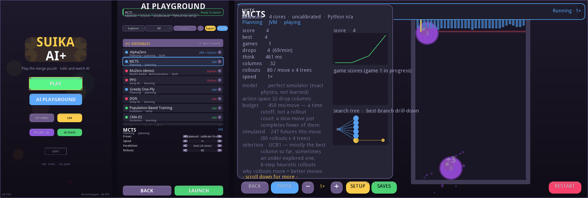
</p>

<p align="center">
  <a href="https://github.com/ericcayers-ai/suikaAI-plus/releases/latest"><strong>Download v0.19.0 →</strong></a>
  ·
  <a href="#quick-start">Quick start</a>
  ·
  <a href="#visual-tour">Screens</a>
  ·
  <a href="#train-an-agent">Train</a>
</p>

---

## Quick start

**Java 21+ on your `PATH`.** Grab the latest ZIP from
[Releases](https://github.com/ericcayers-ai/suikaAI-plus/releases/latest):

```bash
# Linux / macOS
cd suika-app-*/bin && ./suika-app

# Windows
cd suika-app-*\bin && suika-app.bat
```

No Python or GPU required to play or watch JVM agents. Optional GPU training installs from **Settings → AI**.

```bash
./suika-app --headless    # terminal GA demo (CI / servers)
```

---

## Visual tour

### Main menu — one primary path

PLAY drops fruit yourself. **AI PLAYGROUND** is the lab door. Settings and Lab sit as utilities; RT Lab stays experimental.

<p align="center">
  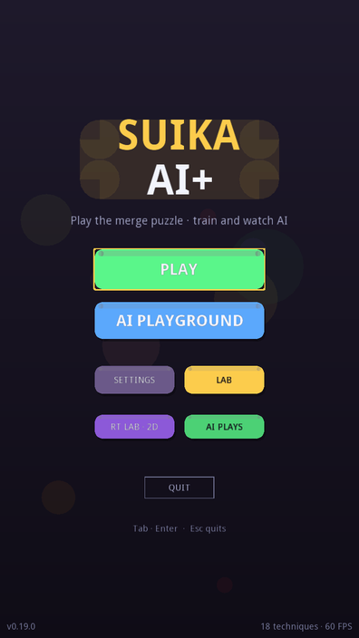
</p>

### AI Playground — pick · tune · launch

Searchable matrix of **13 techniques + 5 ensembles**. Explorer / Researcher modes, hardware presets, Export / Import, then **LAUNCH**.

<p align="center">
  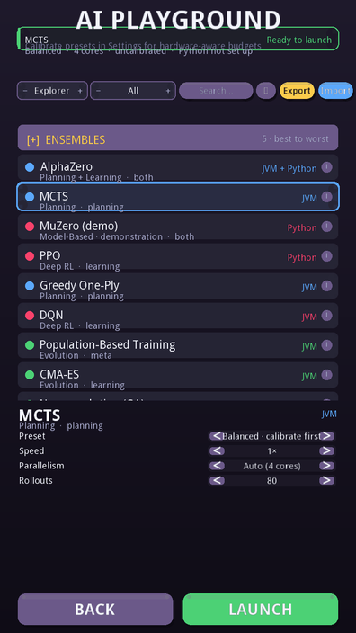
  &nbsp;
  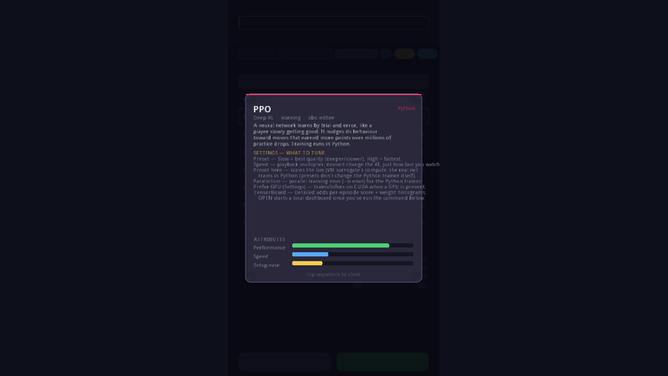
</p>

### Control Center — live boards & diagnostics

Each family gets a specialised run surface: planning trees, evolution grids, imitation dual-board, ONNX slots, hot-swap.

<p align="center">
  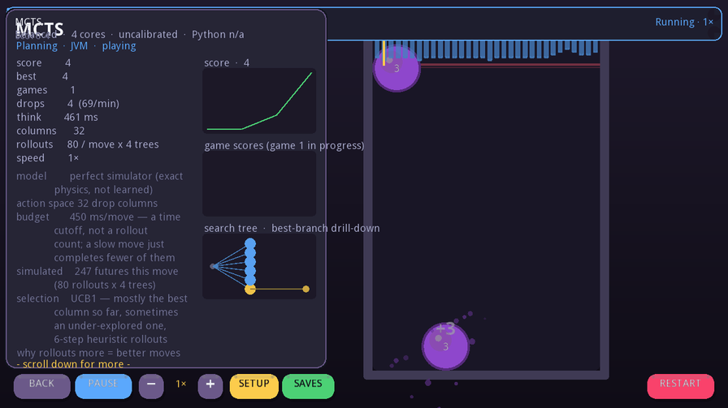
</p>

<p align="center">
  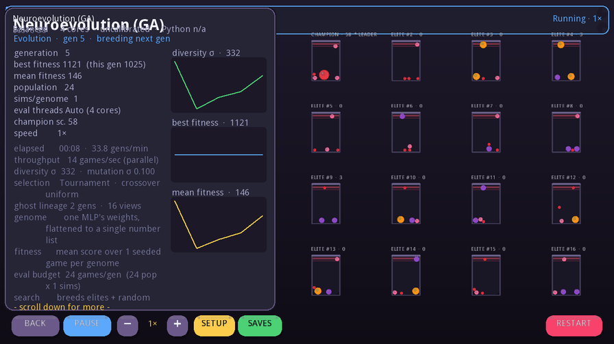
</p>

<p align="center">
  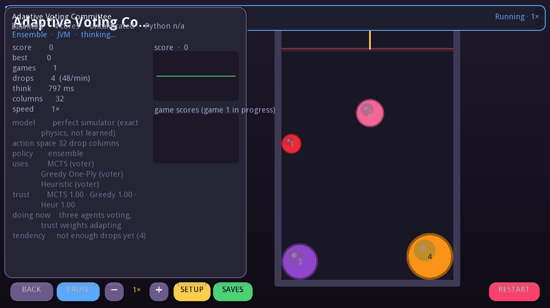
</p>

### Play · Settings · Lab · Game over

| Human play | Settings (jump chips 1–7) | Research Lab |
|:---:|:---:|:---:|
| 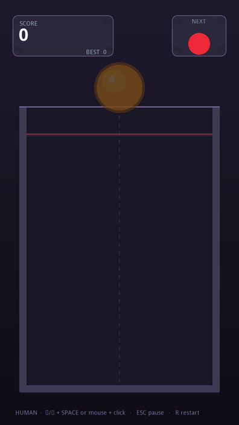 | 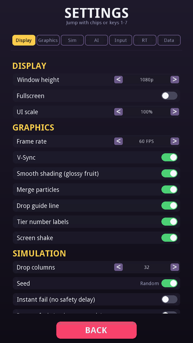 | 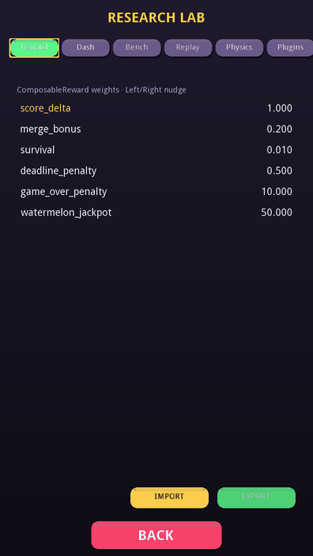 |

<p align="center">
  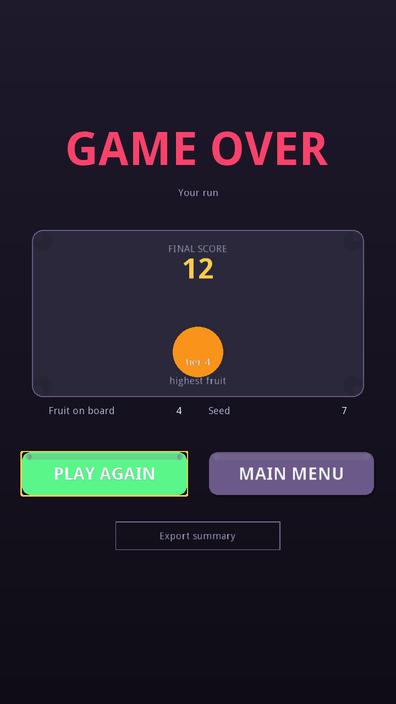
</p>

Crisp FreeType text, glossy fruit, glass jar, merge particles — all procedural.

---

## What's in the box

| Surface | Job |
|---|---|
| **PLAY** | Real-time Suika — mouse / ←→ aim, click or Space to drop |
| **AI PLAYGROUND** | Capability matrix → tune knobs → launch a control center |
| **Control Center** | Live boards, charts, SAVES slots, ONNX-aware hot-swap |
| **SETTINGS** | Display · Graphics · Sim · AI · Input · RT Lab · Data |
| **LAB** | Reward Studio, dashboard runs, bounded bench, replay, physics goldens |
| **RT LAB** | Experimental Vulkan ray-traced board (own window) |

### Capability matrix (Playground)

| Family | Techniques |
|---|---|
| **Planning** | Heuristic, Greedy One-Ply, MCTS, AlphaZero |
| **Evolution** | Neuroevolution GA, CMA-ES, Population-Based Training |
| **Imitation** | DAgger, Behavioral Cloning |
| **Deep RL / model** | DQN, PPO, Decision Transformer, MuZero *(demo surrogate)* |
| **Ensembles** | Adaptive Vote, Bandit Meta, MCTS+Net, MCTS+Greedy, RTG+Verify |

Full class map and library-only agents: see [docs/architecture.md](docs/architecture.md).  
Frozen contracts: [docs/contracts.md](docs/contracts.md).

---

## Train an agent

### Zero-setup (JVM only)

```bash
./gradlew :suika-app:run --args="--headless"
# Built-in GA loop — scores per generation in the terminal
```

Or open **AI PLAYGROUND → Neuroevolution → LAUNCH** and watch champions hot-swap live.

### PPO (Python + optional GPU)

```bash
cd python && pip install -e ".[training]"
python -m suika.train_ppo --timesteps 1000000 --n-envs 8 --out models/ppo
# → models/ppo/policy.onnx  →  copy into ~/.suikai/saves/<id>/slotN/model.onnx
```

### Behavioral cloning → ONNX

```python
from suika.bc import BCTrainer, DemoDataset

ds = DemoDataset.from_recordings("demos/")
trainer = BCTrainer(obs_dim=584, num_actions=32)
trainer.train(ds, epochs=20)
trainer.save_onnx("policy.onnx")
```

### Gymnasium env (standalone Python sim)

```python
import suika

env = suika.make(action_bins=32, seed=42)
obs, info = env.reset()
print(obs.shape)  # (584,)

for _ in range(10):
    obs, reward, terminated, truncated, info = env.step(env.action_space.sample())
print("score:", info["score"])
```

**Deploy without Python at play time:** train → export ONNX → place under
`~/.suikai/saves/<technique>/slotN/model.onnx` → play via `OnnxAgent` / Control Center SAVES.

More recipes (diffusion, Decision Transformer, Java bridge): [docs/architecture.md](docs/architecture.md).

---

## Build from source

```bash
git clone https://github.com/ericcayers-ai/suikaAI-plus.git
cd suikaAI-plus
./gradlew build
./gradlew :suika-app:run
./gradlew :suika-app:distZip   # → suika-app/build/distributions/
```

```bash
cd python
pip install -e .                 # standalone sim
pip install -e ".[gym]"          # + Gymnasium
pip install -e ".[training]"     # + torch / SB3
```

---

## Module map

```
suika-core    deterministic dyn4j physics (no rendering)
suika-assets  fruit ladder / atlas packing
suika-env     observations · rewards · vectorised env
suika-bridge  Java↔Python TCP Gym + ONNX Runtime playback
suika-ai      JVM agents, trainers, ensembles, plugin SPI
suika-dash    metrics, heatmaps, exporters, Lab panel models
suika-game    LibGDX screens, CaptureHarness, RT Lab
suika-app     DesktopLauncher / distribution entry
python/suika  Gymnasium env + PyTorch training toolkit
```

```
 Human / Agent ──► suika-app
                      │
          ┌───────────┼───────────┐
          ▼           ▼           ▼
     suika-game   suika-ai    suika-dash
          │           │
          └─────┬─────┘
                ▼
           suika-env
                ▼
           suika-core
                │
       ┌────────┴────────┐
       ▼                 ▼
  suika-bridge      python/suika
  ONNX Runtime ◄──► PPO / BC / DT / …
```

---

## What's new in v0.19.0

Navigation / QOL UI pass: distilled main menu, shared `UiChrome`, Settings section jump chips,
cleaner Playground / Lab / Game Over hierarchy. Full notes in [CHANGELOG.md](CHANGELOG.md).

---

## Contributing

1. Fork → feature branch  
2. `./gradlew build`  
3. `ruff check python/` and `cd python && pytest -q`  
4. PR against `main`  

See [CONTRIBUTING.md](CONTRIBUTING.md) · [CODE_OF_CONDUCT.md](CODE_OF_CONDUCT.md) · [SECURITY.md](SECURITY.md)

---

## License

[Apache 2.0](LICENSE)
