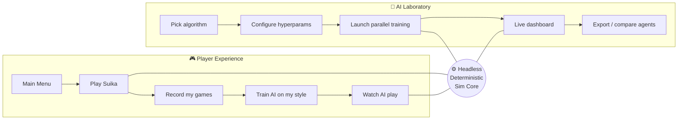
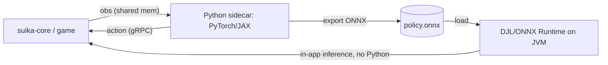
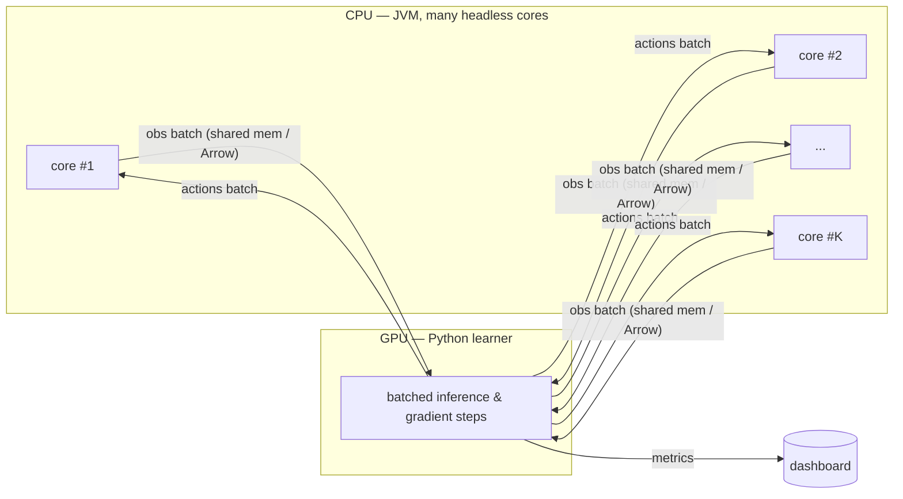
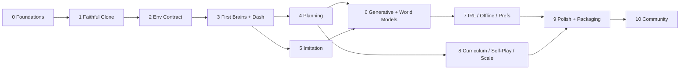

# 🍉 Suika AI Training Sandbox — Project Roadmap

> A pixel-accurate Java clone of *Suika Game* (Aladdin X) fused with a full-spectrum
> AI laboratory. Play the exact game you love, then teach a machine to play it —
> with neuroevolution, planning, imitation, diffusion policies, and a live training
> dashboard, all inside one application.

**Status:** Living north-star vision (shipping as **v0.18.1** after the complete systems
overhaul). Unchecked items below are aspirational unless also checked in [`CHANGELOG.md`](CHANGELOG.md)
or [`ROADMAP-NEXT.md`](ROADMAP-NEXT.md) §Overhaul. For frozen contracts see
[`docs/contracts.md`](docs/contracts.md); for phase wrap-up see [`ROADMAP-NEXT.md`](ROADMAP-NEXT.md).
**Document type:** Living north-star roadmap — exhaustive by design, meant to be pruned into issues/milestones.
**Audience:** Two equally-important readers — the *researcher* who wants every knob, and the *player* who wants to watch an AI learn their game.

---

## Table of Contents

1. [North Star & Guiding Principles](#1-north-star--guiding-principles)
2. [The Project at a Glance](#2-the-project-at-a-glance)
3. [Part I — The Faithful Clone](#part-i--the-faithful-clone)
4. [Part II — Architecture Overview](#part-ii--architecture-overview)
5. [Part III — The Environment Contract](#part-iii--the-environment-contract)
6. [Part IV — The AI Laboratory (Algorithm Zoo)](#part-iv--the-ai-laboratory-algorithm-zoo)
7. [Part V — Parallelism & Performance](#part-v--parallelism--performance)
8. [Part VI — Diagnostics & the Live Dashboard](#part-vi--diagnostics--the-live-dashboard)
9. [Part VII — User Experience & Configurability](#part-vii--user-experience--configurability)
10. [Part VIII — Technology Stack Recommendations](#part-viii--technology-stack-recommendations)
11. [Part IX — Iterative Development Phases](#part-ix--iterative-development-phases)
12. [Part X — Testing, Evaluation & Reproducibility](#part-x--testing-evaluation--reproducibility)
13. [Part XI — Challenges & Mitigations](#part-xi--challenges--mitigations)
14. [Part XII — Extensibility & Community](#part-xii--extensibility--community)
15. [Part XIII — Stretch Goals & Future Directions](#part-xiii--stretch-goals--future-directions)
16. [Appendices](#appendices)

---

## 1. North Star & Guiding Principles

**The one-sentence vision:** *Build the most faithful Suika Game clone in the JVM ecosystem, and make it the best place in the world to watch, understand, and experiment with how an AI learns to play it.*

Everything in this roadmap is downstream of a single architectural conviction:

> **Own the simulation. Decouple it from the screen.**
> If the game logic and physics live in a headless, deterministic, serializable core — independent of rendering, input, and the window — then the *same* core that draws a beautiful 60 FPS game for a human can be forked ten thousand times a second to plan a move, snapshotted for Monte-Carlo rollouts, and vectorized across every CPU core for training. The "perfect clone" and the "AI sandbox" stop being two projects and become two views of one engine.

### Guiding principles

| Principle | What it means in practice |
|---|---|
| **Fidelity first** | The clone must be indistinguishable from the original *before* a single neuron is trained. The AI lab is worthless if the environment is wrong. |
| **Determinism is a feature** | Same seed + same actions ⇒ same trajectory, bit-for-bit where feasible. Reproducibility, planning, and regression testing all depend on it. |
| **Two front doors** | A casual player and a PhD student should both feel the app was built for them. Progressive disclosure, not dumbing-down. |
| **Headless ≥ Headful** | Every feature should be usable without a window. Rendering is one consumer of the core, not the center of it. |
| **Pluggable everything** | Algorithms, observation encoders, reward functions, and dashboards are plugins behind interfaces. Adding a new RL method shouldn't touch the game. |
| **Honest instrumentation** | Show real metrics, including the ugly ones (variance, collapse, reward hacking). The dashboard is a microscope, not a marketing reel. |
| **Respect the source** | Replicate mechanics and feel; treat copyrighted sprites/audio as *user-supplied* assets. Ship with original/open art. (See [Appendix F](#appendix-f--legal--ethical-notes).) |

### What "done" looks like (success criteria)

- A blindfolded Suika veteran cannot tell the clone from the original by feel.
- A new RL algorithm can be added as a single plugin class + config schema, no engine edits.
- A player with zero ML background can click **"Train an AI on my playstyle,"** play ten games, and watch a bot imitate them an hour later.
- A researcher can launch 64 parallel self-play envs, watch live loss/reward/entropy curves, and export everything to TensorBoard/W&B.
- Any trained agent can be replayed, scrubbed, and inspected frame-by-frame with saliency overlays.

---

## 2. The Project at a Glance



**Two products, one engine:**

- **The Game** — a loving, exact reproduction of Suika Game. Drop fruit, merge fruit, chase the watermelon, fear the dead-line.
- **The Lab** — a sandbox where the game becomes a reinforcement-learning environment, an imitation-learning target, a planning problem, and a generative-modeling playground.

The bridge between them is the **Environment Contract** ([Part III](#part-iii--the-environment-contract)): a clean API that turns "a frame of Suika" into observations, actions, and rewards.

---

# Part I — The Faithful Clone

The clone is the foundation. If the physics are off by 5%, every learned policy is learning the wrong game, and every "the AI discovered this strategy" claim is suspect. This part is about getting the game *right*.

## I.1 Core Mechanics

Suika Game is a physics-based merge puzzle:

1. A fruit hovers at the top; the player chooses a horizontal drop position.
2. The fruit falls under gravity into an open-topped container and settles among the others.
3. When **two fruits of the same tier touch**, they **merge** into **one fruit of the next tier**, spawning at the contact point with the combined momentum, and awarding points.
4. The next fruit is previewed; the upcoming fruit is randomly drawn from only the **lower tiers** (you never get handed a melon).
5. If any fruit rests **above the dead-line** for longer than a short grace period, it's **game over**.
6. The goal: maximize score; the dream: create a **Watermelon** (the top tier), and beyond that, merge *two* watermelons.

## I.2 The Fruit Ladder

There are **11 tiers**. The classic ladder (smallest → largest):

| Tier | Fruit | Spawnable from drop? | Notes |
|---:|---|:---:|---|
| 1 | Cherry | ✅ | smallest |
| 2 | Strawberry | ✅ | |
| 3 | Grape | ✅ | |
| 4 | Dekopon (citrus) | ✅ | |
| 5 | Persimmon / Orange | ✅ | highest normally dropped |
| 6 | Apple | ❌ | merge-only |
| 7 | Pear | ❌ | merge-only |
| 8 | Peach | ❌ | merge-only |
| 9 | Pineapple | ❌ | merge-only |
| 10 | Melon | ❌ | merge-only |
| 11 | **Watermelon** | ❌ | top tier; two of them merge & vanish for a big bonus |

> **Calibration note:** the exact set of *droppable* tiers (commonly the lowest five), the spawn probability distribution, each fruit's collision **radius**, and the **scoring** values must be **measured against a reference build**, not assumed. The numbers below are the widely-reproduced community values and should be treated as a starting hypothesis to verify, not gospel.

### Scoring (to verify against reference)

Merge points follow the **triangular numbers** `T(n) = n(n+1)/2` indexed by the *resulting* fruit's tier:

| Result fruit | Strawb. | Grape | Dekopon | Persimmon | Apple | Pear | Peach | Pineapple | Melon | Watermelon | 2× Watermelon |
|---|--:|--:|--:|--:|--:|--:|--:|--:|--:|--:|--:|
| Points | 1 | 3 | 6 | 10 | 15 | 21 | 28 | 36 | 45 | 55 | 100 |

Dropping a fruit scores nothing; **only merges score**. This shapes reward design later (see [III.3](#iii3-reward-design--shaping)).

## I.3 Physics Fidelity — the hard part

The original is built on an **impulse-based 2D rigid-body engine** (the web/Switch lineage uses a Matter.js-style solver). Faithfully reproducing *feel* means reproducing:

- **Gravity** (constant downward acceleration).
- **Restitution** (low — fruits barely bounce).
- **Friction** (static + dynamic — fruits should pile and settle, not slide forever).
- **Density/mass** scaling with fruit size (bigger fruit shoves smaller fruit convincingly).
- **Circular colliders** sized per fruit, with a slight visual-vs-collider radius offset to match the original's "snug" stacking.
- **Sleeping/settling** thresholds (when bodies go to rest), which affect the dead-line timer.
- **Solver iteration counts** and **fixed timestep**, which subtly change stacking behavior.

### The Matter.js ⇄ Java problem

No Java physics engine is bit-compatible with Matter.js, because solvers differ (sequential impulses vs. position-based, different iteration orders, different friction models). Three viable strategies, in order of increasing effort/fidelity:

| Strategy | Engine | Fidelity | Effort | Recommendation |
|---|---|---|---|---|
| **A. Calibrate a JVM engine** | [dyn4j](https://dyn4j.org/) (pure-Java) or JBox2D | High after tuning | Medium | ✅ **Start here.** dyn4j is clean, deterministic-friendly, well-documented. |
| **B. Port the solver** | Hand-port Matter.js constraint solver to Java | Very high | High | Stretch goal if calibration plateaus. |
| **C. Embed the original solver** | Run Matter.js via GraalJS inside the JVM | Highest | Medium-High, perf risk | Useful as a *reference oracle* for calibration even if not shipped. |

**Recommended path:** Build on **dyn4j** for a pure-JVM, deterministic, headless-friendly engine, and **calibrate empirically** against reference recordings.

### Calibration methodology (how to *prove* fidelity)

1. **Capture reference trajectories** from the original (screen recordings + scripted drop sequences at known x-positions and seeds).
2. **Track fruit centers** in the reference video (classic CV / blob tracking) to get ground-truth position-over-time.
3. **Define a fidelity metric:** e.g., mean per-fruit positional error over time, settling-time error, merge-event timing error.
4. **Optimize physics constants** (gravity, restitution, friction, density curve, radius offsets, solver iterations) to *minimize* that metric — this is itself an optimization problem you can hand to **CMA-ES or Bayesian optimization** (a fun first use of the AI stack on the *game itself*).
5. **Lock golden trajectories** as regression tests ([Part X](#part-x--testing-evaluation--reproducibility)).

> Calibrating physics with the same optimizer library you'll later use for neuroevolution is a satisfying early integration test — and a great demo.

## I.4 Container, Boundaries & the Dead-Line

- **Container**: an open-topped box, taller than it is wide (roughly a 2:3-ish aspect; measure exactly). Walls + floor are static colliders. Reproduce wall thickness and any rounded corners — they affect how fruit settles in the bottom corners.
- **Dead-line**: a horizontal threshold near the top. The game-over rule is *time-above-line*, not *instant-cross* — a fruit briefly poking above during a drop is fine; **resting** above the line past the grace period ends the game. Reproduce the grace duration and the visual warning state (the line/aura reddening).
- **Drop constraints**: the hovering fruit's x is clamped so the fruit can't spawn clipping through a wall; reproduce the clamp margins.

## I.5 UI / UX Parity

The clone must match the **whole presentation**, not just the play-field:

- **Main menu** — title, start, settings; matching layout/animation/feel.
- **In-game HUD** — current **score**, **best/high score**, the **next-fruit preview**, and the held/hovering fruit indicator.
- **Drop affordance** — the guide showing where the fruit will fall (if present in the reference) and the hover animation.
- **Merge feedback** — pop/scale animation and particle/“sparkle” on merge.
- **Game-over screen** — final score, the cascade/clear animation, retry flow.
- **Window behavior** — **fullscreen toggle**, **resizable window**, correct **aspect-ratio handling** / letterboxing so the play-field never distorts.
- **Pause, restart, settings** overlays.

> **Resolution independence:** render the game at a fixed virtual resolution and scale to the window (LibGDX `Viewport` / `FitViewport`). This keeps physics in a stable coordinate space regardless of window size — essential both for parity *and* for giving the pixel-based AI a consistent observation regardless of how the human resized the window.

## I.6 Sprites, Art & Audio

- **Asset pipeline:** texture atlas (packed sprite sheet) for all 11 fruits + UI, loaded via an asset manager; data-driven fruit definitions (tier → sprite, radius, score, density).
- **Animation:** merge pop, drop bounce, idle wobble, game-over cascade.
- **Audio:** drop sfx, merge sfx (often pitch-laddered by tier), bgm, game-over sting.
- **Legal stance (important):** the original sprites and audio are **copyrighted by Aladdin X**. Ship the project with **original or open-licensed placeholder art** that matches the *layout and sizing* exactly, and provide a clean **"drop-in asset pack"** mechanism so a user can supply their own assets for personal/educational use. Document this clearly. (See [Appendix F](#appendix-f--legal--ethical-notes).)

## I.7 Determinism & the Fixed Timestep

This is the seam between "game" and "lab," so it gets its own section:

- **Fixed timestep** (e.g., a constant `dt` with an accumulator) decouples physics from frame rate. Rendering may interpolate; physics must not depend on wall-clock.
- **Seeded RNG** drives the fruit sequence and any jitter. The seed is part of the saved game / episode.
- **Deterministic engine config:** fixed solver iteration counts, stable contact ordering, no time-dependent randomness.
- **Float determinism caveat:** exact bit-reproducibility across CPUs/JITs is hard with floating point. Mitigations: pin solver settings, consider `strictfp`-style discipline in the core, and for cross-machine reproducibility provide an optional **fixed-point** or **deterministic-math** mode. At minimum, guarantee *same-machine* reproducibility and treat cross-machine as best-effort. This caveat matters for MCTS/MuZero rollouts and for sharing replays.

---

# Part II — Architecture Overview

## II.1 The Big Picture

```mermaid
flowchart TB
    subgraph Headless["⚙️ suika-core  (no UI, no GPU, pure logic)"]
        Phys[Physics: dyn4j] --> State[GameState: fruits, score, RNG, deadline timer]
        State --> Rules[Rules: drop, merge, game-over]
        Rules --> Snap[Snapshot / clone / serialize]
    end

    subgraph Render["🖥️ suika-game  (LibGDX)"]
        Draw[Renderer + sprites] --> Input[Human input + menus + HUD]
    end

    subgraph EnvAPI["🔌 suika-env  (Environment Contract)"]
        Obs[Observation encoders\npixels | state] --> Act[Action space]
        Act --> Rew[Reward functions]
        Rew --> Vec[Vectorized / snapshot-able envs]
    end

    subgraph AI["🧠 suika-ai  (algorithm zoo)"]
        JVMrl[JVM-native: neuroevolution, MCTS, planning]
        Bridge[Python bridge]
    end

    subgraph Py["🐍 python sidecar / embedded"]
        Torch[PyTorch / JAX]
        Libs[SB3 · CleanRL · RLlib · Tianshou]
    end

    subgraph Dash["📊 suika-dash  (diagnostics)"]
        Charts[Live charts: loss/reward/winrate]
        Multi[Multi-run grid · replays · saliency]
    end

    Headless --> Render
    Headless --> EnvAPI
    EnvAPI --> AI
    AI <--> Bridge
    Bridge <--> Py
    AI --> Dash
    EnvAPI --> Dash
    Headless --> Dash
```

## II.2 The Keystone — `suika-core` (headless, deterministic)

The single most important module. It contains **the entire game** with **zero rendering or input dependencies**:

- Physics world, fruit bodies, container, RNG, scoring, dead-line timer, game-over logic.
- A `step(action)` that advances one decision (drop + settle) or one physics tick, depending on granularity.
- **Snapshotting:** `clone()` a full game state cheaply, `serialize()`/`deserialize()` to bytes. This unlocks **MCTS, MuZero search, and "what-if" planning** — you fork the live game, try a drop, read the outcome, discard.
- **Speed:** must run *headless at thousands of decisions/sec* per thread. Object pooling, no allocations in the hot loop, no logging in the inner loop.

Everything else — the window, the AI, the dashboard — is a **consumer** of this core. Build it first; build it pristine.

## II.3 Module Layout (Gradle multi-module)

```
suika-ai-sandbox/
├── suika-core/        # headless deterministic sim (the keystone). Pure Java, dyn4j.
├── suika-assets/      # data-driven fruit defs, atlas packing, (placeholder) art/audio
├── suika-game/        # LibGDX rendering, input, menus, HUD, window mgmt
├── suika-env/         # Environment Contract: obs encoders, action/reward, vectorization
├── suika-ai/          # JVM-native AI: neuroevolution, MCTS/AlphaZero, planning, plugin SPI
├── suika-bridge/      # Java↔Python (JEP / GraalPy / gRPC sidecar), Gym/PettingZoo adapters
├── suika-dash/        # live dashboard (ImGui+ImPlot), replay viewer, exporters (TB/W&B/MLflow)
├── suika-app/         # the assembled application: wires game + lab + dashboard + settings
├── python/            # pip package: gym env, training scripts, SB3/CleanRL/RLlib glue
├── docs/              # this roadmap, design notes, calibration reports, ADRs
└── tests/             # golden trajectories, determinism, env conformance, agent benchmarks
```

**Why multi-module:** enforces the "headless ≥ headful" boundary at the *build* level — `suika-core` literally cannot depend on `suika-game`, so rendering can never leak into logic.

## II.4 The Java ⇄ Python Boundary

The requirement is explicit: **Python, directly inside the game.** Python owns the deep-learning ecosystem (PyTorch, JAX, the entire RL library landscape); the JVM owns the game and the real-time UI. We need both, well-joined. Options:

| Mechanism | What it is | Pros | Cons | Use for |
|---|---|---|---|---|
| **JEP** (Java Embedded Python) | CPython in-process via JNI | Real numpy/torch, shared process, fast for moderate data | Native build, GIL, lifecycle care | Embedded "Python console" + tight inference loops |
| **GraalPy** (GraalVM) | Python *on the JVM*, polyglot | True shared objects, no IPC | Not 100% CPython-compatible for all C-extensions | Polyglot scripting, lightweight models |
| **gRPC / ZeroMQ sidecar** | Separate Python process | Clean isolation, scales to many workers, crash-safe | Serialization cost, two processes | Heavy training, distributed actors |
| **Apache Arrow / shared memory** | Zero-copy buffers between processes | Fast for pixels/batches | Setup complexity | High-throughput observation transfer |
| **DJL / ONNX Runtime (JVM)** | Run models *without Python* | No Python at all for inference; pure-JVM deploy | Training still wants Python | Shipping a trained agent to players |

**Recommended hybrid:**

- **Embedded (JEP or GraalPy)** for the in-app **"Python Lab" console** and tight, low-latency inference so the requirement of *"Python directly inside the game"* is met literally — a user can open a panel, write `policy(obs)`, and watch the fruit drop.
- **Sidecar (gRPC + Arrow/shared-mem)** for **heavy parallel training**, where isolation and multi-process scaling matter and a GIL would bottleneck.
- **DJL/ONNX** as the **deployment path**: training happens in Python, the final policy is exported to **ONNX**, and the shipped game runs it on the JVM with no Python dependency — so a casual player downloads one app, no `pip install`.



---

# Part III — The Environment Contract

This is the API that turns Suika into a learning problem. It must be **Gymnasium-shaped** so the whole Python RL ecosystem plugs in for free, and **snapshot-able** so JVM planners can search.

## III.1 Observation Modes — pixels vs. state

The brief requires **both** unsupervised (imagery-only) and supervised (full internal state). The encoder is a pluggable strategy:

### (a) Pixel mode — *"unsupervised" / vision*

- Render the play-field (or read the framebuffer) to an image; **downsample** (e.g., 84×84 or 96×96), optional **grayscale**, optional **frame-stacking** (4 frames) for motion.
- Forces the agent to *perceive* the board like a human — sprite recognition, spatial reasoning.
- Pairs with **CNNs**, **vision transformers**, and **representation learning** (autoencoders, contrastive, MAE).
- A subtlety: Suika is *mostly* static between drops, so frame-stacking matters less than in Atari; but during settling/merging, motion frames carry information.

### (b) State mode — *"supervised" / symbolic*

Full internal truth — a variable-length set of fruits:

```
per fruit:   { x, y, vx, vy, angle, angularVel, tier, radius, asleep }
globals:     { currentFruitTier, nextFruitTier, score, deadlineY,
               timeAboveDeadline, containerBounds }
```

The challenge: **variable count of fruits** ⇒ you can't use a plain fixed MLP. Encoding choices:

| Encoding | How | Good for |
|---|---|---|
| **Set / Deep Sets** | permutation-invariant pooling over per-fruit features | order-independence |
| **Transformer (self-attention)** | fruits as tokens, attend over them | relational reasoning ("can these two merge?") |
| **Graph NN** | fruits as nodes, edges by proximity | local contact structure |
| **Rasterized heatmaps** | render state into multi-channel grid (one channel per tier) | reuse CNNs without pixels; fixed-shape |

> **Power move:** the **rasterized multi-channel heatmap** gives you the best of both worlds — a fixed-shape, CNN-friendly tensor that still carries exact symbolic info (tier per channel, velocity channels). Offer it as a third "hybrid" mode.

### (c) Privileged / asymmetric

Train a **critic** with full state (supervised) while the **actor** sees only pixels (unsupervised) — *asymmetric actor-critic*. Great for teaching pixel agents efficiently. The Environment Contract should let obs mode differ per network.

## III.2 Action Space

In Suika the decision is essentially **"where to drop."**

| Action space | Definition | Pairs with |
|---|---|---|
| **Discrete-N** | quantize container width into N bins (e.g., 16/32/64) | DQN, AlphaZero, NEAT |
| **Continuous** | `x ∈ [x_min, x_max]`, optionally normalized to `[-1, 1]` | PPO, SAC, diffusion/flow policies |
| **Hybrid** | continuous x + optional discrete "nudge/timing" | advanced experiments |

**Decision cadence:** the natural step is **per-drop** — agent picks x, the core *drops and simulates until settle* (or N ticks), then returns the next obs/reward. This makes episodes short (tens–low-hundreds of decisions) and training fast. Optionally expose a **fine-grained tick mode** for agents that want to act during settling (rarely needed, but available).

## III.3 Reward Design & Shaping

Reward design *is* the experiment in Suika. Offer a **composable reward** built from toggleable terms (each weight exposed in the settings panel):

| Term | Signal | Purpose / risk |
|---|---|---|
| **Score delta** | points gained this step | the honest objective |
| **Merge bonus** | extra for high-tier merges | encourages building up, not just clearing |
| **Survival** | small + per step alive | discourages reckless stacking |
| **Dead-line proximity penalty** | − as fruit nears the line | safety / risk-awareness (can induce over-caution) |
| **Potential-based shaping** | `γΦ(s') − Φ(s)` with `Φ` = e.g. negative max-height | dense, *policy-invariant* guidance (safe shaping) |
| **Watermelon jackpot** | big terminal-style bonus for top-tier | the dream objective; very sparse |
| **Game-over penalty** | large negative on death | strong terminal signal |

> Expose a **"reward studio"** where users mix terms with sliders and *immediately* see, on a replay, how each historical action would have been scored. This makes reward shaping legible to non-experts and is a flagship teaching tool. It also surfaces **reward hacking** (e.g., an agent that farms tiny merges forever to milk survival bonus) — which is itself a great lesson.

## III.4 Gym / PettingZoo Compatibility

- **Single-agent:** implement the **Gymnasium** API (`reset`, `step`, `render`, `close`, `observation_space`, `action_space`, `seed`). Instant compatibility with **Stable-Baselines3, CleanRL, Tianshou, RLlib, Sample Factory**.
- **Multi-agent / self-play:** implement the **PettingZoo** API for competitive variants ([IV.10](#iv10-self-play--multi-agent)).
- **Vectorized:** provide a native **VectorEnv** (many headless cores in parallel) so on-policy algos get high throughput without per-env IPC overhead.

## III.5 Episode Lifecycle, Seeding, Snapshots, Vectorization

- `reset(seed)` → deterministic initial state + first fruit.
- `step(action)` → `(obs, reward, terminated, truncated, info)`; `info` carries the rich stuff (per-term reward breakdown, merges this step, max height, etc.) for the dashboard.
- `snapshot()/restore()` → for planners (MCTS/MuZero) and for "rewind" in the replay viewer.
- `clone()` → fork for parallel rollouts.
- **Vectorization** spins up K cores across threads (Project Loom virtual threads) or processes.

## III.6 Data Formats

| Artifact | Format | Why |
|---|---|---|
| **Replay** | compact event log: seed + action sequence (+ periodic state checksums) | tiny, exactly reconstructs a game via the deterministic core |
| **Demonstration dataset** | Parquet/Arrow of `(obs, action, reward, next_obs, done, info)` | imitation/offline RL; columnar, fast, language-agnostic |
| **Checkpoint** | framework-native (`.pt`) + portable **ONNX** | train in Python, deploy on JVM |
| **Experiment config** | YAML/JSON (schema-validated) | reproducibility, presets, diffing runs |
| **Run metrics** | TensorBoard event files / W&B / MLflow + local SQLite | live dashboard + post-hoc analysis |

> The replay-as-(seed+actions) format is only possible *because* the core is deterministic — a few KB reconstructs an entire match. This is the recurring payoff of the keystone decision.

---

# Part IV — The AI Laboratory (Algorithm Zoo)

This is the heart of the sandbox. Each technique below gets: **what it is**, **how it integrates here**, **what it's for in Suika**, and which **data mode** it favors. They share the Environment Contract and a common **plugin SPI** (`AgentPlugin` / `TrainerPlugin`) so each is selectable in the settings panel.

> **Reading guide:** techniques are grouped. A consolidated [capability matrix](#iv13-capability-matrix) at the end maps every method to data mode, learning-vs-planning, whether it exploits the perfect simulator, and parallelizability.

## IV.1 Baselines (build these first — they're your sanity checks)

- **Random** policy — calibrates the floor; verifies the env, reward, and dashboard plumbing end-to-end.
- **Heuristics** — e.g., "drop on the nearest same-tier fruit," "keep the surface flat," "avoid the tallest column." Cheap, surprisingly strong, and a benchmark every learned agent must beat to be interesting.
- **Greedy one-ply** — using the simulator, try every discretized drop, simulate to settle, pick the best immediate score/heuristic. The first agent that *uses the snapshot API*, and a natural stepping stone to search.

## IV.2 Planning & Search (exploit the perfect model)

Because `suika-core` is forkable and fast, **planning works without learning a model — you already have the exact one.**

- **A\* / best-first / beam search over drop sequences.** Treat each state as a node, each discretized drop as an edge, simulate transitions with the core. A* needs an admissible-ish heuristic (e.g., potential score from current board). **Purpose:** strong scripted opponent, demonstrations for imitation, upper-bound reference. **Caveat:** branching × stochastic next-fruit makes full search explode; pair with sampling.
- **Monte-Carlo Tree Search (MCTS).** The natural fit: sample next-fruit draws, roll out drops, back-propagate scores. Pure MCTS already plays Suika *well*. **Purpose:** powerful baseline, teacher for distillation, and the search core of AlphaZero/MuZero.
- **AlphaZero-style (MCTS + learned policy/value).** Learn a net that proposes promising drops and evaluates boards; MCTS uses it to search deeper with fewer rollouts; the search results train the net. **Purpose:** the flagship "strong, self-improving, model-based planner." Suika's exact simulator means we get AlphaZero's assumptions for *free* (perfect model) — a rare luxury.

> **Why this is special:** most RL domains must *learn* a world model (the hard part). Suika hands you a perfect, fast, forkable one. Lead with planning — it's where this project's architecture shines brightest.

## IV.3 Model-Based RL & World Models

- **MuZero.** Learns a *latent* dynamics model and plans with MCTS in latent space. Here it's a fascinating contrast: compare MuZero's *learned* model against the *true* simulator — a built-in ablation that teaches what model-based RL actually buys you. Works in **pixel mode** (no privileged state needed).
- **Dreamer / world models (RSSM).** Learn a recurrent latent world model from pixels, "imagine" rollouts, train a policy inside the dream. **Purpose:** sample-efficient pixel-mode learning; and a gorgeous **dashboard demo** — visualize the agent's *imagined* games beside the real one.

## IV.4 Value & Policy Deep RL (the workhorses)

- **DQN family** (DQN, Double, Dueling, Prioritized Replay, Rainbow). Discrete-N actions, pixel or state obs. **Purpose:** classic baseline; great for teaching value functions and replay buffers.
- **PPO.** On-policy, stable, parallel-env-friendly — pairs perfectly with the native VectorEnv. **Purpose:** the default "just train something good" button; continuous or discrete actions.
- **SAC.** Off-policy, continuous actions, sample-efficient, entropy-regularized. **Purpose:** continuous drop-position control with strong exploration.
- **A3C / IMPALA / APPO.** Distributed actor-learner — many headless cores feed a central learner. **Purpose:** *throughput*; showcases [Part V](#part-v--parallelism--performance) parallelism.

## IV.5 Neuroevolution (no gradients, embarrassingly parallel)

Evolve neural controllers by selection + mutation rather than backprop — and it runs **100% on the JVM**, no Python required, making it the **perfect first learning method to ship**.

- **GA over fixed-topology weights** — simplest; evolve MLP weights against episode score as fitness.
- **Evolution Strategies / CMA-ES** — covariance-adaptive, strong on continuous params; also reused for *physics calibration* ([I.3](#i3-physics-fidelity--the-hard-part)).
- **NEAT / HyperNEAT** — evolve *topology and weights*; watch networks grow complexity over generations (a beautiful dashboard story).
- **Novelty Search / Quality-Diversity (MAP-Elites)** — reward *behavioral diversity*, not just score; produces a *gallery* of stylistically distinct players (the cautious flat-stacker, the risky tower-builder). **Purpose:** an *archive of strategies* a player can browse and play against — directly serves the casual audience.

**Integration:** fitness = average score over seeded games; evaluate a whole population across CPU cores via headless cores. **Purpose:** gradient-free, trivially parallel, visually intuitive — the friendliest "AI is learning" experience for non-experts.

## IV.6 Imitation Learning (the casual player's flagship)

Learn from **the player's own recorded games** — the headline feature for non-researchers.

- **Behavioral Cloning (BC).** Supervised: map observed board → the action the human took. Record games via the replay system, build an `(obs, action)` dataset, fit a policy. **Purpose:** *"train an AI on my playstyle"* in one click.
- **DAgger.** BC compounds errors when the agent drifts off the human's distribution. DAgger interleaves: let the agent act, have the "expert" (the human, *or* the MCTS planner) label the visited states, retrain. **Purpose:** robust imitation without endless human labeling — use **MCTS as a tireless expert**.

> Pairing **MCTS-as-expert** with **DAgger/distillation** yields a fast neural net that plays near-MCTS strength but runs in microseconds — shippable to players. This is the AlphaZero idea reused as a product feature.

## IV.7 Inverse RL & Preference Learning (recover the *why*)

- **Inverse RL (MaxEnt IRL, GAIL, AIRL).** Instead of copying actions, *infer the reward function* that explains the human's play, then optimize it. **Purpose:** answer "what is this player *actually* valuing?" — and generate agents that pursue the *intent*, generalizing beyond copied moves.
- **Preference-based / RLHF-style.** Show a player two short agent clips; they pick the nicer one; fit a reward model to preferences; optimize it. **Purpose:** teach subjective "style/aesthetics" (e.g., "satisfying cascades") that no hand-written reward captures — and a genuinely fun, accessible interaction.

## IV.8 Offline RL (learn from logs, no live play)

From a pile of recorded games (human or agent), learn *without* further environment interaction:

- **CQL / IQL** — conservative/implicit value learning that avoids over-valuing unseen actions.
- **Decision Transformer / Trajectory Transformer** — frame RL as **sequence modeling**: condition on a desired return, autoregressively predict actions. **Purpose:** "play to reach score X" conditioning; a modern, intuitive paradigm; and a natural bridge to the generative-model section.

## IV.9 Curriculum Learning (grow the difficulty)

Don't start agents on the full game — *shape the syllabus*:

- **Fruit-ladder curriculum:** begin with fewer tiers / a smaller container; widen as competence grows.
- **Sequence curriculum:** start with friendly fruit sequences (more early matches), anneal to fully random.
- **Automatic curricula:** **PLR** (prioritize levels where the agent learns most), **teacher-student**, **self-paced** difficulty. The "teacher" can be an **adversarial fruit-sequence generator** (ties into self-play & GANs below).

**Integration:** the Environment Contract already parameterizes tier-set, container size, and the fruit-draw distribution — curriculum is just scheduling those parameters. **Purpose:** faster, more stable learning; and a clear visual narrative of progress for the dashboard.

## IV.10 Self-Play & Multi-Agent

Suika is single-player by default, so we *invent* competition — and the architecture (cheap parallel cores) makes it trivial:

- **Racing self-play:** two agents play the *same* seeded fruit sequence; reward = relative score. Symmetric, league-trainable, and a great spectator mode (split-screen). **Purpose:** robust skill via competition; populations and leagues (à la AlphaStar) of stylistically varied bots.
- **Adversarial sequence-setter (the killer multi-agent framing):** one agent **plays**, an adversary **chooses the next fruit** (within rules) to make life hard. This is a **minimax / PSRO** setup that produces *robust* players and doubles as **automatic curriculum** and **GAN-like** dynamics. **Purpose:** anti-fragile policies; a principled difficulty engine.
- **Population-Based Training (PBT):** a population trains in parallel, periodically copying winners' weights and perturbing hyperparameters — **optimizes hyperparameters *and* policy at once**, and showcases parallelism.

**Integration:** PettingZoo API + the native VectorEnv. **Purpose:** robustness, emergent strategy diversity, and the most *watchable* training mode for an audience.

## IV.11 Generative Models (GANs, Diffusion, Flow Matching, VAEs)

Generative modeling enters Suika through **three distinct doors** — content, policy, and dynamics:

### (a) Generating *content* (sequences & boards)
- **GANs** to generate **plausible/adversarial fruit sequences** or **realistic board states** — feeds curricula and data augmentation. The adversarial sequence-setter ([IV.10](#iv10-self-play--multi-agent)) is essentially a GAN where the "discriminator" is the player agent's struggle.
- **VAEs** to learn a **latent space of board states** — sample new boards, interpolate between situations, and (crucially) **visualize the latent map** in the dashboard (UMAP/t-SNE), letting users *see* the space of Suika positions.

### (b) Generating *actions* (generative policies) — the modern frontier
- **Diffusion Policy.** Represent the policy as a conditional **diffusion model** that denoises an action (drop position / short plan) given the board. Excels at **multimodal** action distributions — when two different drops are equally good, a diffusion policy can represent *both* instead of averaging into a bad middle. **Purpose:** state-of-the-art imitation/offline policy that captures human *strategic ambiguity*. Trains beautifully on the BC/offline dataset.
- **Flow Matching.** A continuous-normalizing-flow cousin of diffusion that learns a velocity field transporting noise → actions; **faster, often-simpler training** and **fewer inference steps** than diffusion. **Purpose:** the efficient, modern alternative to diffusion policies — ideal when you need real-time action generation in the live game. Offer **diffusion vs. flow-matching as a head-to-head** experiment (same data, compare quality/latency) — a fantastic teaching artifact.

### (c) Generating *dynamics* (already covered)
- World models ([IV.3](#iv3-model-based-rl--world-models)) are generative models of the *environment*. Worth naming here so the taxonomy is complete: **generate content, generate actions, or generate the world.**

> **Why generative policies matter in Suika specifically:** the game is full of near-ties (many drops are "fine"). Unimodal policies (vanilla PPO/BC) collapse these to a bland average; diffusion/flow policies preserve the *multiple good options*, producing more human-like, varied, and robust play. This is a concrete, demonstrable advantage — not a buzzword.

## IV.12 Exploration, Representation, HPO & the Playful Extras

- **Intrinsic motivation (RND, ICM, curiosity).** Reward novelty to escape the "farm tiny merges forever" local optimum and discover tower-and-collapse strategies. **Purpose:** better exploration of Suika's sparse high-tier rewards.
- **Representation learning (pixel mode):** autoencoders, **contrastive (SimCLR/CURL)**, **masked autoencoders (MAE)**, DINO-style. Pre-train a visual encoder unsupervised on rendered frames, then attach a lightweight policy head. **Purpose:** make pixel-mode RL tractable and sample-efficient; directly serves the "unsupervised imagery-only" requirement.
- **Hierarchical RL (options).** High-level "build toward a melon in the left well" → low-level drops. **Purpose:** long-horizon strategy; interpretable sub-goals.
- **Hyperparameter optimization:** **Optuna / Bayesian optimization / Ray Tune**, plus PBT ([IV.10](#iv10-self-play--multi-agent)). **Purpose:** stop hand-tuning; auto-find good configs; show the search in the dashboard.
- **LLM-as-agent (on-theme, playful).** Feed the *symbolic state* to an LLM and ask for the next drop with chain-of-thought; use it as a zero-shot baseline, an explainer ("why drop there?"), or a demonstration generator for imitation. **Purpose:** an accessible, narratable agent and a bridge between "AI" as the public imagines it and RL as it actually works.

## IV.13 Capability Matrix

| Technique | Data mode | Learning vs Planning | Uses true sim model? | Parallelism | JVM-native? |
|---|---|---|---|---|---|
| Random / Heuristic | either | neither | optional | trivial | ✅ |
| Greedy 1-ply | state | planning | ✅ | per-action | ✅ |
| A* / Beam | state | planning | ✅ | per-branch | ✅ |
| MCTS | either | planning | ✅ | per-rollout | ✅ |
| AlphaZero | pixels/state | both | ✅ | high | ✅ search / 🐍 net |
| MuZero | pixels | both | learns its own | high | 🐍 |
| Dreamer | pixels | model-based | learns its own | medium | 🐍 |
| DQN/Rainbow | either | learning | no | medium | 🐍 |
| PPO | either | learning | no | high (vec-env) | 🐍 |
| SAC | state/pixels | learning | no | medium | 🐍 |
| IMPALA/APPO | pixels | learning | no | very high | 🐍 |
| Neuroevolution (GA/ES/NEAT/QD) | either | learning (gradient-free) | optional | embarrassing | ✅ |
| Behavioral Cloning | either | imitation | no | data-parallel | 🐍 |
| DAgger (+MCTS expert) | either | imitation | ✅ (expert) | medium | ✅+🐍 |
| Inverse RL / GAIL | either | imitation+RL | no | medium | 🐍 |
| Preference / RLHF | either | reward-learning | no | medium | 🐍 |
| Offline RL (CQL/IQL/DT) | either | offline | no | data-parallel | 🐍 |
| Curriculum | either | meta | optional | — | ✅+🐍 |
| Self-play / Adversarial / PBT | either | learning | optional | very high | ✅+🐍 |
| GAN / VAE (content) | pixels/state | generative | no | data-parallel | 🐍 |
| Diffusion / Flow policy | either | generative policy | no | data-parallel | 🐍 |
| RND / ICM | pixels | exploration | no | with base algo | 🐍 |
| Repr. learning (AE/contrastive/MAE) | pixels | self-supervised | no | data-parallel | 🐍 |
| HPO (Optuna/PBT/Ray) | — | meta | — | very high | 🐍 |
| LLM agent | state | zero-shot/plan | no | api-bound | 🐍 |

---

# Part V — Parallelism & Performance

Parallelism isn't an optimization here — it's the difference between "trains overnight" and "trains over a coffee," and the only way the live multi-run dashboard has anything to show.

## V.1 Where the parallelism lives



- **Vectorized headless envs.** K instances of `suika-core` stepping in parallel. With **Project Loom virtual threads**, K can be large and cheap; for CPU-bound physics, a bounded pool sized to cores is the real limit. For full isolation/scale, run envs in separate processes.
- **Actor–learner split (IMPALA/SEED/Sample Factory style).** JVM **actors** generate experience fast; the Python **learner** consumes batches on GPU. Decouples simulation throughput from gradient throughput.
- **Batched GPU inference.** Never call the net once per env — gather K observations, run one batched forward pass, scatter K actions. The single biggest throughput lever for neural policies.
- **Neuroevolution = embarrassingly parallel.** Each genome's fitness is an independent set of headless games — saturate every core with no synchronization. Ship this first to prove the parallel harness.
- **Population/PBT & HPO.** Whole training runs in parallel (Ray), periodically exchanging weights/hyperparams.

## V.2 Crossing the JVM↔Python boundary fast

- **Zero-copy observations** via **Apache Arrow** / shared-memory ring buffers — critical for pixel batches (don't serialize 84×84×4×K every step through gRPC).
- **Batch everything**; amortize per-call overhead.
- **Keep the hot path allocation-free** on the JVM (object pooling for fruits/contacts) to dodge GC pauses — essential both for training throughput and for never stuttering the 60 FPS human game.
- **Off-heap buffers** for observation tensors handed to native code.

## V.3 Determinism ⇄ parallelism tension

Parallel + async can reorder events and break bit-reproducibility. Mitigations: **per-env seeded RNG** (independent streams), deterministic single-env replay even if training was parallel (you logged seed+actions), and a "**reproducible mode**" toggle that trades some throughput for strict ordering. Document the trade-off plainly.

## V.4 Performance targets (hypotheses to measure)

| Metric | Target (to validate) |
|---|---|
| Headless decisions/sec/core | thousands |
| Vectorized envs on a desktop | 32–128 |
| Human game frame rate | locked 60 FPS, no GC stutter |
| MCTS rollouts per move (interactive) | enough for strong play within ~100 ms |
| Pixel obs throughput | K×frames/sec without serialization stalls |

---

# Part VI — Diagnostics & the Live Dashboard

A training run you can't see is a black box. The dashboard turns it into a microscope — and into a *spectacle* for the casual user.

## VI.1 Metrics Catalog

**Universal:** episode return, episode length, score distribution, best score, win-rate (self-play), wall-clock & sample throughput (FPS / steps-sec).
**Gradient RL:** policy loss, value loss, **entropy**, **KL divergence**, explained variance, gradient norm, learning rate, advantage stats, replay-buffer stats.
**Neuroevolution:** fitness max/mean/min per generation, population diversity, **species count (NEAT)**, **genealogy/lineage**, QD archive coverage (MAP-Elites grid fill).
**Imitation/IRL:** action-match accuracy, recovered-reward heatmaps, discriminator accuracy (GAIL).
**Generative:** sample quality, mode coverage, diffusion/flow denoising trajectories, FID-like board realism, latent-space maps.
**Model-based:** learned-model prediction error vs. the *true* simulator (a built-in honesty check).

## VI.2 Visualization Widgets

- **Live line charts** (loss/reward/win-rate/entropy/…) with smoothing, multi-series overlay, and run comparison.
- **Action heatmaps** — *where* does the agent like to drop? Evolves over training; instantly legible.
- **Saliency / attention overlays** (pixel agents) — what is the CNN/transformer *looking at*? Grad-CAM on the board.
- **Reward decomposition** — stacked contribution of each reward term per step (pairs with the Reward Studio).
- **Latent-space explorer** — UMAP/t-SNE of states or VAE latents, brushable, click a point → see that board.
- **Population view** — fitness landscape, species tree, QD archive grid (click a cell → watch that behavior).
- **Generative gallery** — sampled fruit sequences / boards; diffusion vs. flow side-by-side denoising animations.

## VI.3 Multi-Run Visualization — *only where it makes sense*

The brief wisely says visualize many runs **where it's meaningful**. Apply judgment:

| Show many simultaneously | Show one, switch on demand |
|---|---|
| Self-play / racing matches (split or grid) | A single PPO run's gradients (one set of curves) |
| Population champions (top-K genomes playing) | Detailed replay scrub of one episode |
| Curriculum stages progressing | Saliency for one agent |
| Diffusion vs. flow head-to-head | — |

A **live grid of thumbnail games** is electric for population/self-play training (and the best "AI is learning!" moment for newcomers) — but a wall of 64 identical PPO curves is noise. Default to **aggregate + drill-down**: show distributions/means across runs, let users expand any single run.

## VI.4 Replay Viewer & Inspector

- Scrub any episode (seed+actions ⇒ exact reconstruction via the core), step frame-by-frame, jump to merges/near-deaths.
- Overlay the agent's **considered alternatives** (MCTS visit counts per column, policy logits) — *see the agent think*.
- Diff two agents on the same seed side-by-side.

## VI.5 Tech & Experiment Tracking

- **In-app, real-time:** **ImGui (imgui-java) + ImPlot** rendered in the LibGDX GL context — immediate-mode, fast, perfect for live tooling and tight loops; no separate process.
- **Deep analysis / persistence:** bridge to **TensorBoard**, **Weights & Biases**, and/or **MLflow** — log scalars/histograms/media so researchers get the tooling they already trust, and runs survive the app closing.
- **Local store:** SQLite + Parquet for run metadata and metrics, so the dashboard works fully offline.

> Native ImGui for the *now*, TB/W&B/MLflow for the *forever*. Two layers, no compromise.

---

# Part VII — User Experience & Configurability

The make-or-break requirement: **equally welcoming to a computer scientist and a Suika fan.** The answer is **two front doors over one engine** via progressive disclosure.

## VII.1 Two Personas, Two Modes

| | 🎮 **Explorer Mode** (default) | 🔬 **Researcher Mode** |
|---|---|---|
| Mental model | "Watch an AI learn my game" | "Run controlled experiments" |
| Algorithm choice | Friendly presets ("Quick Learner", "Imitate Me", "Master Planner") | Full zoo + every variant |
| Hyperparameters | Hidden behind sane defaults; a few big sliders ("learn faster ⇄ steadier") | Every knob, schema-driven, with tooltips & cited defaults |
| Data mode | Auto-chosen per preset | Manual: pixels / state / hybrid / asymmetric |
| Output | "Your AI scored 1,240! Play against it →" | curves, ablations, exports, configs |
| Reward | Reward Studio with plain-language sliders | Full composable terms + custom code |

Same buttons, same engine — Researcher Mode just *unhides* what Explorer Mode chose for you. A curious player can always "show advanced," and a researcher can always demo to a friend.

## VII.2 The Settings Panel (schema-driven)

- Each algorithm **declares its own hyperparameter schema** (name, type, range, default, help text). The UI is **generated** from the schema — add an algorithm, get its settings panel for free. No bespoke UI per method.
- **Config presets** save/load as YAML; runs are reproducible and diffable.
- **Live-apply where safe** (e.g., learning-rate, exploration); **restart-required** flags where not (e.g., network architecture). The panel makes the distinction explicit.

## VII.3 Flagship Casual Flows

1. **"Train an AI on my playstyle."** Play → auto-recorded → one click → BC/diffusion-policy trains → "Watch it play" / "Play against it." Imitation learning as a *toy*, not a tutorial.
2. **"Watch the AI master Suika."** Launch a preset (neuroevolution or AlphaZero), sit back, watch the thumbnail grid and the score climb across generations. The QD archive becomes a **roster of rival bots** to challenge.
3. **"Reward Studio."** Slide what the AI cares about; watch a replay re-score live; discover reward hacking yourself.
4. **"Beat the bot."** Matchmake against any trained/archived agent on a shared seed — pure fun that quietly teaches what the AI learned.

## VII.4 Onboarding, Tutorials & Accessibility

- **Guided experiments**: pre-baked "lessons" ("See overfitting," "Watch curriculum help," "Diffusion vs. flow") that launch configured runs with annotations.
- **In-app glossary & tooltips** linking every term to a one-line explanation (and [Appendix E](#appendix-e--suggested-reading--key-papers) for depth).
- **Accessibility**: colorblind-safe fruit palettes (don't rely on hue alone — shape/label too), scalable UI, keyboard navigation, reduced-motion option.

---

# Part VIII — Technology Stack Recommendations

| Concern | Recommendation | Strong alternatives | Why |
|---|---|---|---|
| **Language (engine/UI)** | **Java 21+** (virtual threads, modern APIs) | Kotlin (interops cleanly) | JVM ecosystem, performance, Loom concurrency |
| **Physics** | **dyn4j** (pure-Java, deterministic-friendly) | JBox2D; ported Matter.js solver | clean, headless, calibratable |
| **Rendering / game** | **LibGDX** (OpenGL, viewports, atlases, cross-platform) | JavaFX; LWJGL3 raw; Swing (no) | game-grade 2D, scales to window, asset tooling |
| **In-app dashboard** | **imgui-java + ImPlot** | JavaFX charts; embedded web (Plotly/D3) | immediate-mode, fast, ML-tooling-grade |
| **Java↔Python** | **JEP/GraalPy (embedded)** + **gRPC sidecar** | Py4J; ZeroMQ | literal "Python in the game" + scalable training |
| **Fast IPC** | **Apache Arrow / shared memory** | raw sockets + msgpack | zero-copy pixel batches |
| **DL framework (train)** | **PyTorch** (+ optional JAX) | TensorFlow | the RL library center of gravity |
| **RL libraries** | **Stable-Baselines3, CleanRL, Tianshou** | RLlib (Ray), Sample Factory, PufferLib | breadth + readability + throughput |
| **Neuroevolution** | JVM-native (custom + CMA-ES lib) | Python: EvoTorch, PyGAD | runs without Python; ships first |
| **JVM inference / deploy** | **DJL + ONNX Runtime** | TorchScript via JNI | ship trained agents, no Python for players |
| **Experiment tracking** | **TensorBoard + W&B + MLflow** | Aim, Neptune | researchers' existing tools |
| **HPO / distributed** | **Optuna**, **Ray Tune** | Nevergrad | auto-tuning, PBT, scale-out |
| **Build** | **Gradle** (multi-module) | Maven | enforces the headless/headful boundary |
| **Packaging** | **jpackage / jlink** native installers | GraalVM native-image (advanced) | one-download app for players |
| **Data** | **Parquet/Arrow + SQLite** | HDF5 | columnar datasets, offline metrics |

> **Guiding bet:** *JVM for the game and real-time UI; Python for the deep learning; ONNX as the handshake that lets a trained brain ship inside a pure-JVM app.*

---

# Part IX — Iterative Development Phases

Sequenced so that **something is always playable/demoable**, and each phase unlocks the next. Phases are themes, not rigid sprints; later phases parallelize once the core is solid.

### Phase 0 — Foundations
- Multi-module Gradle scaffold; CI; ADR log; coding standards.
- Tech spikes: dyn4j determinism, LibGDX viewport scaling, JEP/GraalPy hello-world, gRPC+Arrow round-trip.
- **Exit:** empty modules build; a fruit falls in a headless test; Python can step a stub env.

### Phase 1 — The Faithful Clone 🎯 *(the make-or-break phase)*
- `suika-core`: physics, fruits, merging, scoring, dead-line, game-over, RNG, fixed timestep, snapshot/serialize.
- `suika-game`: rendering, sprites/atlas, input, menus, HUD, next-fruit, game-over, fullscreen/resize.
- **Calibration**: capture reference, track centers, optimize constants (CMA-ES), lock golden trajectories.
- **Exit:** a human can't distinguish it from the original; golden-trajectory regression tests pass.

### Phase 2 — The Environment Contract
- `suika-env`: pixel + state + hybrid encoders; discrete/continuous actions; composable reward; Gym API; VectorEnv; replay/demo formats.
- **Exit:** a random agent and a heuristic run headless; replays reconstruct bit-exactly; Python `gym.make("Suika-v0")` works.

### Phase 3 — First Brains + First Dashboard
- **Neuroevolution (JVM, parallel)** as the first learner (no Python dependency) + **PPO via SB3** (sidecar).
- `suika-dash` v1: live reward/loss curves, score distribution, a thumbnail grid for the population.
- **Exit:** an agent convincingly beats the heuristic; you can *watch* it improve live.

### Phase 4 — Planning (cash in the perfect simulator)
- MCTS; greedy/beam/A*; then **AlphaZero-style** (MCTS + net).
- MCTS-visit overlays in the replay viewer ("see it think").
- **Exit:** a planning agent is the new strongest; it serves as a teacher/demonstrator.

### Phase 5 — Learn From Humans
- Recording UX; **Behavioral Cloning**; **DAgger** (with MCTS-as-expert); **distillation** of MCTS→fast net.
- **Explorer Mode** "Train an AI on my playstyle" flow.
- **Exit:** a casual user trains a personal bot in one sitting and plays against it.

### Phase 6 — The Generative & Model-Based Frontier
- **Diffusion Policy** and **Flow Matching** (head-to-head); **VAE/GAN** content + latent explorer.
- **MuZero / Dreamer** (pixel-mode) with learned-vs-true-model comparison.
- **Exit:** a diffusion/flow policy shows measurable multimodal/robustness wins; world-model "imagination" visualized.

### Phase 7 — Inverse RL, Offline RL & Preferences
- GAIL/AIRL; CQL/IQL; Decision Transformer; preference-based RLHF-style UI.
- **Exit:** agents trained purely from logs/preferences; recovered-reward heatmaps in the dashboard.

### Phase 8 — Curriculum, Self-Play & Scale
- Curricula (fruit-ladder, PLR); racing self-play; **adversarial sequence-setter**; PBT; IMPALA throughput.
- Multi-run aggregate+drill-down dashboard; HPO (Optuna/Ray).
- **Exit:** league/population training runs stable at scale; the multi-run viz earns its keep.

### Phase 9 — Polish, UX Tiers & Packaging
- Explorer/Researcher modes; schema-driven settings; Reward Studio; guided lessons; accessibility.
- ONNX export + DJL in-app inference; **jpackage** installers (no-Python player build); docs.
- **Exit:** one-download app a non-coder enjoys *and* a researcher trusts.

### Phase 10 — Community & Extensibility
- Plugin SPI docs; "bring-your-own-agent" template; sample plugins; benchmark leaderboard; modding hooks.
- **Exit:** an external contributor adds a new algorithm without touching the engine.



---

# Part X — Testing, Evaluation & Reproducibility

## X.1 Physics & Game Correctness
- **Golden-trajectory regression:** stored reference trajectories (seed + actions ⇒ expected fruit positions/score within tolerance). Any physics tweak must pass or consciously re-bless the goldens.
- **Property tests:** conservation/sanity (no fruit escapes the box, merges always raise tier by exactly 1, score deltas match the table, game-over only above the line past grace).
- **Determinism tests:** same seed+actions ⇒ identical state (same machine bit-exact; cross-machine within tolerance, or exact in fixed-point mode).

## X.2 Environment Conformance
- Gym/PettingZoo API compliance suite; observation/action space validity; reward-term unit tests; VectorEnv equivalence (K parallel == K sequential, modulo seeding).

## X.3 Agent Evaluation Protocol
- **Standard benchmark:** a fixed set of held-out seeds; report **mean ± std score over N games**, plus watermelon-rate and survival length. *Train and evaluate on disjoint seed sets* to catch seed-overfitting.
- **Leaderboard:** every agent type ranked on the standard benchmark — heuristic, MCTS, PPO, neuroevolution, diffusion policy, your-plugin-here. Makes "is this actually better?" answerable.
- **Ablations as first-class:** the dashboard's run-compare *is* the ablation tool (reward terms on/off, pixel vs. state, diffusion vs. flow).

## X.4 Reproducibility Hygiene
- Every run pinned to a config (YAML) + code version + seed; artifacts (checkpoints, metrics, replays) bundled. "Reproduce this result" = load the config.

## X.5 CI
- Build all modules; run core/env unit + determinism + golden tests on every PR; nightly short training smoke-tests (does PPO/neuroevolution still *learn anything* on a tiny budget?) to catch silent regressions in the learning path.

---

# Part XI — Challenges & Mitigations (Risk Register)

| # | Risk | Likelihood | Impact | Mitigation |
|---|---|---|---|---|
| 1 | **Physics never *quite* matches** Matter.js feel | High | High | Calibrate with CMA-ES against tracked reference; golden tests; escalate to porting/embedding the original solver if it plateaus |
| 2 | **Float non-determinism** across machines breaks replays/planning | Med | Med | Same-machine determinism guaranteed; optional fixed-point mode; log seed+actions+checksums |
| 3 | **JVM↔Python is the bottleneck** | High | Med | Shared-memory/Arrow zero-copy; batch inference; sidecar multiprocessing; ONNX for deploy |
| 4 | **GC stutter** in the 60 FPS game or training | Med | Med | Object pooling, off-heap buffers, allocation-free hot loops, tune GC (ZGC/Shenandoah) |
| 5 | **Variable-length state** is awkward for nets | Med | Med | Deep Sets / Transformer / GNN / rasterized heatmaps offered as encoders |
| 6 | **Sparse high-tier reward** (watermelon is rare) | High | Med | Potential-based shaping, intrinsic motivation, curriculum, leverage MCTS/planning |
| 7 | **Reward hacking** (farm tiny merges) | Med | Low/Med | Reward Studio to *see* it; careful shaping; survival caps; it's also a teachable feature |
| 8 | **Scope explosion** (too many algorithms) | High | High | Plugin SPI + capability matrix; ship baselines→neuroevolution→planning first; rest are pluggable add-ons |
| 9 | **Copyright** on sprites/audio | Certain | Legal | Original/open placeholder art matching layout; user-supplied asset packs; document clearly |
| 10 | **Sample inefficiency** of pixel RL | High | Med | Representation pre-training (MAE/contrastive), world models, asymmetric privileged critic, state/hybrid modes |
| 11 | **Dashboard overload** (64 useless curves) | Med | Low | Aggregate+drill-down; multi-run only where meaningful; sensible defaults |
| 12 | **Two-audience UX collapses** into "too simple" or "too scary" | Med | High | Progressive disclosure; Explorer/Researcher modes over one engine; guided lessons |

---

# Part XII — Extensibility & Community

- **Plugin SPI:** `AgentPlugin` (acts), `TrainerPlugin` (learns), `ObservationEncoder`, `RewardFunction`, `DashboardPanel` — discovered via Java `ServiceLoader`. Each declares a hyperparameter schema → auto-generated settings UI.
- **Bring-Your-Own-Agent:** a template repo + a thin contract (`reset/act`); drop a Python policy (any framework, via the bridge) or a JVM agent and it appears in the menu and on the leaderboard.
- **Benchmark & leaderboard:** standardized seeds + metrics make community submissions comparable; optional shared leaderboard.
- **Modding:** data-driven fruit ladders (more tiers? different sizes?), alternate containers, house-rule variants — each becomes a new curriculum/benchmark for free.
- **Docs:** architecture overview, ADRs, "add an algorithm in 30 minutes" tutorial, calibration report, API reference.

---

# Part XIII — Stretch Goals & Future Directions

- **Web build** (LibGDX→HTML/WebGL or a thin web client) so anyone can watch training in a browser.
- **Mobile** companion to record games on the go for imitation datasets.
- **Tournament/league server** hosting persistent agent ladders.
- **Natural-language coaching:** an LLM watches your replays and suggests improvements grounded in the symbolic state.
- **Sim-to-real-ish transfer:** train on the calibrated clone, evaluate on the original via screen-capture + CV — does the policy survive the reality gap? A genuine research question this architecture can ask.
- **Procedural variants** as a generalization benchmark (new fruit ladders/containers the agent never trained on).
- **Interpretability deep-dives:** circuit-level analysis of what a strong Suika net actually computes.
- **Auto-discovered curricula & open-endedness** (POET-style) co-evolving environments and agents.

---

# Appendices

## Appendix A — Glossary

| Term | Meaning |
|---|---|
| **Dead-line** | the upper threshold; resting fruit above it past the grace period ends the game |
| **Tier / ladder** | the 11-step fruit progression cherry→…→watermelon |
| **Headless core** | the game logic/physics with no rendering, runnable thousands of times/sec |
| **Snapshot** | a cloned game state used for planning/rollouts/rewind |
| **Observation mode** | pixels (vision/unsupervised) vs. state (symbolic/supervised) vs. hybrid |
| **Vectorized env** | many parallel environment instances stepped together |
| **Behavioral Cloning** | supervised imitation: board → human's action |
| **DAgger** | iterative imitation that queries an expert on the agent's own visited states |
| **MCTS** | Monte-Carlo Tree Search — sampling-based planning over drops |
| **AlphaZero / MuZero** | MCTS guided by a learned net (true model / learned model) |
| **Neuroevolution** | evolving neural controllers via selection+mutation (gradient-free) |
| **Quality-Diversity / MAP-Elites** | search for a *diverse archive* of high-performing behaviors |
| **Diffusion / Flow policy** | generative policies that denoise / flow noise into actions (multimodal) |
| **Inverse RL** | infer the reward function behind demonstrations |
| **Potential-based shaping** | dense reward shaping that provably doesn't change the optimal policy |
| **PBT** | Population-Based Training — joint policy + hyperparameter evolution |
| **ONNX** | portable model format; the train-in-Python, run-on-JVM handshake |

## Appendix B — Reference Constants to Calibrate (checklist)

Treat each as **measured from the reference**, not assumed:

- [ ] Gravity magnitude · fixed `dt` · solver iteration counts
- [ ] Restitution · static & dynamic friction · density-vs-tier curve
- [ ] Per-tier collision radius · visual-vs-collider radius offset
- [ ] Container inner dimensions · wall thickness · corner geometry · drop-x clamp margins
- [ ] Dead-line Y · grace period before game-over · warning thresholds
- [ ] Droppable tier set · next-fruit probability distribution
- [ ] Score table (verify the triangular values & the 2×watermelon bonus)
- [ ] Merge spawn point (contact midpoint?) & inherited momentum rule
- [ ] Sleep/settle velocity thresholds

## Appendix C — Example Experiment Config (illustrative)

```yaml
experiment: ppo_state_baseline
seed: 42
env:
  observation: state          # pixels | state | hybrid
  state_encoder: transformer  # deepset | transformer | gnn | raster
  action_space: discrete      # discrete | continuous
  action_bins: 32
  reward:
    score_delta: 1.0
    merge_bonus: 0.2
    survival: 0.01
    deadline_penalty: 0.5
    potential_shaping: true
    watermelon_jackpot: 50.0
    game_over_penalty: 10.0
  curriculum:
    enabled: false
algorithm:
  name: ppo                   # plugin id; schema auto-generates the UI
  hyperparameters:
    learning_rate: 3.0e-4
    gamma: 0.997
    gae_lambda: 0.95
    clip_range: 0.2
    entropy_coef: 0.01
    n_envs: 64
    n_steps: 256
    batch_size: 4096
parallelism:
  vector_envs: 64
  device: cuda
logging:
  trackers: [tensorboard, wandb]
  dashboard_live: true
eval:
  benchmark_seeds: holdout_500
  games: 500
```

## Appendix D — Example Environment API (illustrative)

**Python (Gymnasium-shaped):**
```python
import suika

env = suika.make(
    observation="state",        # "pixels" | "state" | "hybrid"
    action_space="discrete", action_bins=32,
    reward_config=my_reward, seed=42,
)
obs, info = env.reset(seed=42)
done = False
while not done:
    action = policy(obs)                       # 0..31  -> drop column
    obs, reward, terminated, truncated, info = env.step(action)
    done = terminated or truncated
    # info: {"merges": [...], "max_height": ..., "reward_terms": {...}}

# vectorized for training
venv = suika.make_vec(num_envs=64, observation="pixels", frame_stack=4)
```

**Java (the snapshot-able core — what planners use):**
```java
GameState s = core.reset(seed);
GameState fork = s.snapshot();          // O(1)-ish clone for planning
StepResult r = core.step(fork, Action.dropColumn(12));
// r.observation(), r.reward(), r.terminated(), r.info()
double value = mcts.search(s, /*rollouts=*/512);   // uses snapshot() internally
```

## Appendix E — Suggested Reading / Key Papers

Pointers per technique (for the in-app glossary and curious users):

- **Deep RL baselines:** DQN/Rainbow; PPO; SAC; IMPALA.
- **Planning & model-based:** MCTS/UCT; AlphaZero; MuZero; Dreamer (world models).
- **Neuroevolution & QD:** NEAT; CMA-ES; Evolution Strategies for RL; Novelty Search; MAP-Elites.
- **Imitation & inverse RL:** Behavioral Cloning; DAgger; MaxEnt IRL; GAIL; AIRL.
- **Offline & sequence RL:** CQL; IQL; Decision Transformer; Trajectory Transformer.
- **Generative policies:** Diffusion Policy; Flow Matching / continuous normalizing flows; conditional GANs/VAEs.
- **Exploration & representation:** RND; ICM; CURL/SimCLR; Masked Autoencoders.
- **Curriculum & open-endedness:** automatic curricula / PLR; PSRO; POET.
- **Preferences:** preference-based RL / RLHF.

*(Maintain exact citations in `docs/reading.md`; this roadmap names the methods so they're easy to look up.)*

## Appendix F — Legal & Ethical Notes

- **Mechanics vs. assets:** game *rules/mechanics* are reproducible; the *specific sprites, audio, and branding* of Suika Game are **© Aladdin X** and must not be redistributed.
- **Ship clean:** distribute with **original or open-licensed** placeholder art/audio that matches layout/sizing, plus a documented **user-supplied asset-pack** mechanism for personal/educational use.
- **Trademark:** don't imply official affiliation; describe the project as an *independent, educational clone & AI sandbox inspired by* Suika Game.
- **Data:** recorded human gameplay is the player's own; keep it **local by default**, opt-in for any sharing/leaderboards, and be transparent about what imitation learning stores.
- **Honesty in claims:** report agent results with seeds, variance, and held-out evaluation — no cherry-picked high scores presented as typical.

---

> *“Own the simulation, decouple it from the screen, and let every learner — evolved, planned, imitated, or diffused — drink from the same deterministic well.”*
>
> Build the game perfectly. Then teach the machine to love watermelons. 🍉
